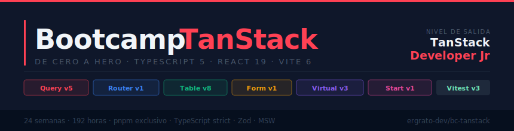

<p align="center">
  
</p>

<p align="center">
  <a href="LICENSE"></a>
  <a href="#"></a>
  <a href="#"></a>
  <a href="#"></a>
  <a href="#"></a>
  <a href="#"></a>
</p>

<p align="center">
  <a href="README_EN.md"></a>
</p>

---

## 📋 Descripción

Bootcamp intensivo de **24 semanas (~6 meses)** diseñado para llevar a
estudiantes desde cero hasta TanStack Developer Junior. El
enfoque es 100% práctico: cada semana combina teoría concisa, ejercicios
guiados y un proyecto integrador adaptado al dominio asignado.

> 🏛️ **Política de Dominios Únicos (Anticopia)**: Cada aprendiz trabaja sobre
> un dominio de negocio único asignado por el instructor (Biblioteca, Farmacia,
> Gimnasio, etc.). Esto garantiza implementaciones originales y previene la
> copia entre compañeros.

### 🎯 Objetivos

Al finalizar el bootcamp, los estudiantes serán capaces de:

- ✅ Gestionar server state con TanStack Query v5 (cache, mutations, infinite queries, optimistic updates)
- ✅ Construir SPAs y apps SSR con routing completamente type-safe (TanStack Router)
- ✅ Implementar tablas de datos complejas con operaciones server-side (TanStack Table)
- ✅ Manejar formularios complejos con validación síncrona y asíncrona (TanStack Form)
- ✅ Virtualizar listas y grids masivos sin degradación de performance (TanStack Virtual)
- ✅ Desarrollar aplicaciones full-stack con SSR y server functions (TanStack Start)
- ✅ Integrar todo el ecosistema en una arquitectura coherente y mantenible

### 🚀 ¿Por qué TanStack?

> **Server state primero, client state después** — el orden correcto para
> aprender aplicaciones React modernas.

El ecosistema TanStack resuelve los problemas más complejos del desarrollo
frontend: cache inteligente, routing type-safe, tablas de datos avanzadas y
formularios con validación asíncrona. Los estudiantes aprenden las mismas
herramientas que usan equipos de producto reales.

---

## 🗓️ Estructura del Bootcamp

| Etapa | Semanas | Horas | Temas Principales |
| :---: | :-----: | :---: | --- |
| **Etapa 0** — Fundamentos Técnicos | 1–3 | 24h | TypeScript, React moderno, Tooling |
| **Etapa 1** — TanStack Query: Fundamentos | 4–7 | 32h | `useQuery`, `queryKey`, `useMutation`, cache |
| **Etapa 2** — TanStack Query: Avanzado | 8–10 | 24h | Infinite queries, Suspense, optimistic updates, testing |
| **Etapa 3** — TanStack Router | 11–14 | 32h | Type-safe routing, loaders, auth patterns |
| **Etapa 4** — TanStack Table | 15–17 | 24h | Headless tables, sorting, server-side ops |
| **Etapa 5** — TanStack Form | 18–19 | 16h | Form state, Zod, async validation |
| **Etapa 6** — TanStack Virtual + Start | 20–22 | 24h | Virtualization, SSR, full-stack |
| **Etapa 7** — Proyecto Final Integrador | 23–24 | 16h | App full-stack con todo el stack |

**Total: 24 semanas** | **~192 horas** de formación intensiva

---

## 📚 Contenido por Semana

Cada semana incluye:

```
bootcamp/week-XX-tema_principal/
├── README.md                 # Descripción y objetivos
├── rubrica-evaluacion.md     # Criterios de evaluación
├── 0-assets/                 # Diagramas SVG (arquitectura, flujo, ciclo de vida)
├── 1-teoria/                 # Material teórico en markdown
├── 2-practicas/              # Ejercicios guiados (descomentar código)
│   └── ejercicio-XX/
│       ├── starter/          # Código comentado para descomentar
│       └── solution/         # Código completo y funcional
├── 3-proyecto/               # Proyecto semanal integrador
│   └── starter/              # Esqueleto con TODOs para implementar
├── 4-recursos/               # Recursos adicionales
│   ├── videografia/
│   └── webgrafia/
└── 5-glosario/               # Términos TanStack/React clave (A–Z)
```

### 🔑 Componentes Clave

- 📖 **Teoría**: Conceptos fundamentales con ejemplos TypeScript/React ejecutables
- 💻 **Práctica**: Ejercicios progresivos (descomenta y ejecuta)
- 📝 **Evaluación**: Evidencias de conocimiento, desempeño y producto
- 🎓 **Recursos**: Glosarios, videografía y referencias oficiales

---

## 🛠️ Stack Tecnológico

| Tecnología | Versión | Uso |
| --- | --- | --- |
| TanStack Query | 5.x | Server state management (etapas 1–2) |
| TanStack Router | 1.x | Type-safe routing (etapa 3) |
| TanStack Table | 8.x | Headless data tables (etapa 4) |
| TanStack Form | 1.x | Form state management (etapa 5) |
| TanStack Virtual | 3.x | Virtualization (etapa 6) |
| TanStack Start | 1.x | Full-stack SSR (etapa 6) |
| TypeScript | 5.x | Type safety en todo el stack |
| React | 19.x | UI layer |
| Vite | 6.x | Bundler (etapas 0–5) |
| Zod | 3.x | Schema validation |
| MSW | 2.x | API mocking en tests |
| Vitest | 3.x | Testing |
| pnpm | 9.x | Package manager exclusivo |
| Git | 2.30+ | Control de versiones |
| VS Code | — | Editor recomendado |

---

## 🚀 Inicio Rápido

### Prerrequisitos

- **Node.js 22+** — runtime de JavaScript
- **pnpm 9+** — gestor de paquetes exclusivo de este bootcamp
- **Git** — para clonar el repositorio
- **VS Code** con las extensiones recomendadas (`.vscode/extensions.json`)

> ⚠️ Este bootcamp usa **exclusivamente pnpm**. Nunca usar `npm` ni `yarn`.

### 1. Clonar el Repositorio

```bash
git clone https://github.com/ergrato-dev/bc-tanstack.git
cd bc-tanstack
```

### 2. Configurar el entorno (una sola vez)

```bash
# Activar versiones exactas globalmente (sin ^ ni ~)
pnpm config set save-exact true

# Configurar el template de commits
git config commit.template .gitmessage
```

### 3. Navegar al Contenido

```bash
# Ir a la primera semana
cd bootcamp/week-01-typescript_esencial

# Ver instrucciones
cat README.md
```

### 4. Instalar y ejecutar un ejercicio

```bash
# Dentro de starter/ o solution/ de cualquier ejercicio
pnpm install

# Iniciar el servidor de desarrollo
pnpm dev
```

---

## 📊 Metodología de Aprendizaje

### Estrategias Didácticas

- 🎯 **Aprendizaje Basado en Proyectos (ABP)**
- 🧩 **Práctica Deliberada** — ejercicios de complejidad incremental
- 🔄 **Dominios Únicos** — cada aprendiz trabaja en su dominio asignado
- 👥 **Code Review** entre pares
- 🎮 **Live Coding** con arquitectura de componentes en tiempo real

### Distribución del Tiempo (8h/semana)

- **Teoría**: 2 horas
- **Prácticas**: 3.5 horas
- **Proyecto**: 2.5 horas

### Evaluación

Cada semana incluye tres tipos de evidencias:

1. **Conocimiento 🧠** (30%): Cuestionarios y evaluaciones teóricas
2. **Desempeño 💪** (40%): Ejercicios prácticos ejecutados correctamente
3. **Producto 📦** (30%): Proyecto entregable adaptado al dominio asignado

**Criterio de aprobación**: Mínimo 70% en cada tipo de evidencia

---

## 🤝 Contribuir

¡Las contribuciones son bienvenidas! Este es un proyecto educativo bajo
licencia [CC BY-NC-SA 4.0](LICENSE) — puedes compartirlo y adaptarlo con
atribución, sin uso comercial y manteniendo la misma licencia.

### Cómo Contribuir

1. Haz fork del repositorio
2. Crea tu rama (`git checkout -b feat/nueva-practica`)
3. Commit con [Conventional Commits](https://www.conventionalcommits.org/) (`git commit -m 'feat(week-04): add useQuery exercise with MSW'`)
4. Push a tu rama (`git push origin feat/nueva-practica`)
5. Abre un Pull Request

### 📋 Áreas de Contribución

- ✨ Ejercicios adicionales
- 📚 Mejoras en documentación y teoría
- 🐛 Corrección de errores en código TypeScript/React
- 🎨 Diagramas SVG (arquitectura, flujo de datos, ciclo de vida)
- 🌐 Traducciones

---

## 📞 Soporte

- 💬 Discussions: [GitHub Discussions](https://github.com/ergrato-dev/bc-tanstack/discussions)
- 🐛 Issues: [GitHub Issues](https://github.com/ergrato-dev/bc-tanstack/issues)

---

## 📄 Licencia

Este proyecto está bajo la licencia
[CC BY-NC-SA 4.0](https://creativecommons.org/licenses/by-nc-sa/4.0/) —
Compartir y adaptar con atribución, sin uso comercial y bajo la misma
licencia. Ver el archivo [LICENSE](LICENSE) para más detalles.

---

## 🏆 Agradecimientos

- [TanStack](https://tanstack.com/) — Por el ecosistema de herramientas más potente del mundo frontend
- [Tanner Linsley](https://github.com/tannerlinsley) — Por crear y mantener TanStack
- [React Team](https://react.dev/) — Por React 19 y el modelo de composición
- [Vite](https://vitejs.dev/) — Por el bundler más rápido del ecosistema
- Todos los contribuidores

---

## 📚 Documentación Adicional

- [🤖 Instrucciones de Copilot](.github/copilot-instructions.md)
- [📖 Documentación General](docs/)

---

## ⚠️ Exención de Responsabilidad

Este repositorio es un recurso educativo de acceso libre, distribuido **tal
como está** (*as-is*), sin garantía de ningún tipo, expresa o implícita.

- El contenido tiene **fines exclusivamente educativos**. No constituye
  asesoramiento profesional en desarrollo de software para entornos productivos.
- Los autores y colaboradores **no se responsabilizan** por daños directos,
  indirectos o consecuentes derivados del uso, aplicación o mal uso del
  material aquí publicado.
- Los **fragmentos de código TypeScript/React** están diseñados para entornos
  de aprendizaje local. **No deben usarse en producción** sin una revisión de
  seguridad adecuada.
- Las referencias a herramientas, libros o servicios de terceros se
  incluyen con fines informativos. Los autores no avalan ni garantizan
  la disponibilidad, exactitud o idoneidad de dichos recursos.
- El material puede contener **errores tipográficos o inexactitudes**.
  Se agradece reportarlos abriendo un
  [Issue](https://github.com/ergrato-dev/bc-tanstack/issues).

---

<p align="center">
  <strong>🎓 Bootcamp TanStack — De Cero a Héroe</strong><br>
  <em>De cero a TanStack Developer Junior en ~6 meses</em>
</p>

<p align="center">
  <a href="bootcamp/week-01-typescript_esencial">Comenzar Semana 1</a> •
  <a href="docs">Ver Documentación</a> •
  <a href="https://github.com/ergrato-dev/bc-tanstack/issues">Reportar Issue</a>
</p>

<p align="center">
  Hecho con ❤️ para la comunidad JavaScript
</p>
