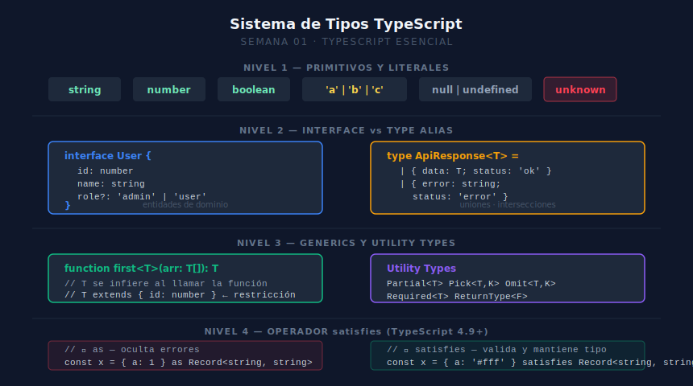

# 03 — Utility Types y `satisfies`

## 🎯 Objetivos

1. Derivar nuevos tipos a partir de existentes con utility types
2. Evitar duplicación de tipos usando `Pick`, `Omit` y `Partial`
3. Aplicar `satisfies` para validar objetos de configuración sin perder su tipo inferido



---

## 1. `Partial` y `Required`

```ts
interface User {
  id: number
  name: string
  email: string
}

// Partial — todos los campos opcionales (útil para PATCH/update)
type UserUpdate = Partial<User>
// { id?: number; name?: string; email?: string }

// Required — todos los campos obligatorios
type StrictUser = Required<User>
```

---

## 2. `Pick` y `Omit`

```ts
interface Product {
  id: number
  name: string
  price: number
  stock: number
  createdAt: Date
}

// Pick — selecciona solo los campos indicados
type ProductCard = Pick<Product, 'id' | 'name' | 'price'>

// Omit — excluye los campos indicados
type ProductForm = Omit<Product, 'id' | 'createdAt'>
// { name: string; price: number; stock: number }
```

---

## 3. `ReturnType` y `Parameters`

Extraen tipos a partir de funciones existentes, evitando repetir tipos ya definidos:

```ts
async function fetchUser(id: number) {
  const res = await fetch(`/api/users/${id}`)
  return res.json() as Promise<{ id: number; name: string }>
}

// El tipo de retorno se extrae automáticamente
type FetchUserReturn = Awaited<ReturnType<typeof fetchUser>>
// { id: number; name: string }
```

---

## 4. El Operador `satisfies`

`satisfies` valida que un objeto cumpla un tipo **sin cambiar el tipo inferido**.
Es mejor que `as` porque no silencia errores:

```ts
type LibraryColors = Record<string, string>

// ❌ Con 'as': pierde el tipo literal, no detecta errores en values
const colors = { query: '#FF4154', router: 42 } as LibraryColors

// ✅ Con 'satisfies': valida Y mantiene el tipo literal
const palette = {
  query: '#FF4154',
  router: '#3B82F6',
  table: '#10B981',
} satisfies LibraryColors

palette.query  // tipo: string (no solo LibraryColors[string])
```

> `satisfies` es la herramienta correcta para objetos de configuración en TanStack.

---

## ✅ Checklist

Antes de continuar, verifica que puedes responder:

1. ¿Cuándo usarías `Partial<User>` en lugar de hacer todos los campos opcionales?
2. ¿Qué diferencia hay entre `Pick<T, K>` y `Omit<T, K>`?
3. ¿Para qué sirve `ReturnType<typeof miFuncion>`?
4. ¿Por qué `satisfies` es más seguro que `as`?

---

## 📚 Referencias

- [TypeScript Handbook — Utility Types](https://www.typescriptlang.org/docs/handbook/utility-types.html)
- [TypeScript 4.9 — satisfies operator](https://www.typescriptlang.org/docs/handbook/release-notes/typescript-4-9.html#the-satisfies-operator)
