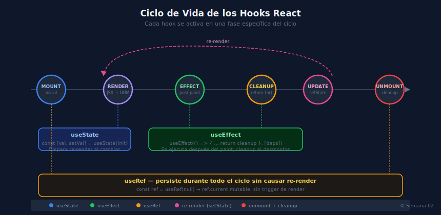

# 01 — Hooks: Estado y Efectos

## 🎯 Objetivos

1. Gestionar estado local con `useState` y sus actualizaciones funcionales
2. Sincronizar componentes con el mundo exterior usando `useEffect`
3. Referenciar valores y nodos DOM sin causar re-renders con `useRef`



## 1. `useState` — Estado local

`useState` retorna un par: el valor actual y una función para actualizarlo.

```tsx
import { useState } from 'react'

// Estado simple
const [count, setCount] = useState<number>(0)

// Actualización funcional — usar cuando el nuevo valor depende del anterior
setCount(prev => prev + 1)
```

> Nunca mutar el estado directamente: `count++` no causa re-render.

## 2. `useEffect` — Efectos secundarios

Se ejecuta después del render. Recibe una función y un array de dependencias.

```tsx
import { useEffect, useState } from 'react'

function Timer() {
  const [seconds, setSeconds] = useState<number>(0)

  useEffect(() => {
    // Configurar el efecto
    const id = setInterval(() => setSeconds(s => s + 1), 1000)

    // Función de limpieza — se ejecuta antes del próximo efecto o al desmontar
    return () => clearInterval(id)
  }, []) // Array vacío = solo al montar/desmontar

  return <p>Tiempo: {seconds}s</p>
}
```

**Reglas del array de dependencias:**
- `[]` → ejecutar solo al montar
- `[valor]` → ejecutar cuando `valor` cambie
- Sin array → ejecutar en cada render (raramente útil)

## 3. `useRef` — Referencias sin re-render

`useRef` devuelve un objeto `{ current }` que persiste entre renders sin dispararlos.

```tsx
import { useRef, useEffect } from 'react'

function SearchInput() {
  const inputRef = useRef<HTMLInputElement>(null)

  useEffect(() => {
    // Enfocar el input al montar sin causar re-render
    inputRef.current?.focus()
  }, [])

  return <input ref={inputRef} placeholder="Buscar..." />
}
```

**Dos usos principales:**
- Referenciar nodos DOM (`inputRef.current?.focus()`)
- Almacenar valores mutables que no deben causar re-render (timers, IDs de intervalo)

## 4. Diferencia clave: `useState` vs `useRef`

| | `useState` | `useRef` |
|-|-----------|---------|
| Causa re-render | ✅ Sí | ❌ No |
| Persiste entre renders | ✅ Sí | ✅ Sí |
| Uso principal | UI reactiva | DOM / valores internos |

## ✅ Checklist

- ¿Usas actualización funcional cuando el nuevo estado depende del anterior?
- ¿Tu `useEffect` tiene función de limpieza cuando lo necesita?
- ¿Las dependencias del `useEffect` están completas y son correctas?
- ¿Usas `useRef` en lugar de `useState` cuando no necesitas re-render?

## 📖 Referencias

- [useState — React Docs](https://react.dev/reference/react/useState)
- [useEffect — React Docs](https://react.dev/reference/react/useEffect)
- [useRef — React Docs](https://react.dev/reference/react/useRef)
