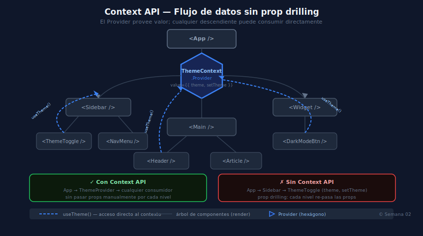

# 03 — Composición, Error Boundaries y Context API

## 🎯 Objetivos

1. Diseñar componentes reutilizables con el patrón de composición (`children`)
2. Capturar errores en el árbol de componentes con Error Boundaries
3. Eliminar prop-drilling compartiendo estado global con Context API



## 1. Composición con `children`

En lugar de controlar todo desde el padre, pasar la estructura como `children`.

```tsx
interface CardProps {
  title: string
  children: React.ReactNode
}

// Componente contenedor — no sabe qué contiene
function Card({ title, children }: CardProps) {
  return (
    <div className="card">
      <h2>{title}</h2>
      {children}
    </div>
  )
}

// El padre decide el contenido
function App() {
  return (
    <Card title="Usuarios">
      <UserList />
      <AddUserButton />
    </Card>
  )
}
```

## 2. Error Boundaries

Capturan errores de render en el subárbol que protegen. Requieren **clase** (React 19 aún no tiene hook equivalente).

```tsx
import { Component, type ReactNode } from 'react'

interface Props { children: ReactNode; fallback: ReactNode }
interface State { hasError: boolean }

class ErrorBoundary extends Component<Props, State> {
  state: State = { hasError: false }
  static getDerivedStateFromError(): State { return { hasError: true } }
  render() {
    return this.state.hasError ? this.props.fallback : this.props.children
  }
}

// Uso: envolver secciones críticas con un fallback útil
function App() {
  return (
    <ErrorBoundary fallback={<p>Algo salió mal.</p>}>
      <UserDashboard />
    </ErrorBoundary>
  )
}
```

> **No capturan**: errores asíncronos, event handlers ni errores en SSR.

## 3. Context API — Estado global sin librerías

Evita el prop-drilling creando un contexto accesible desde cualquier componente hijo.

```tsx
import { createContext, useContext, useState, type ReactNode } from 'react'

// 1. Definir el tipo e interfaz del contexto
interface ThemeContextValue {
  theme: 'light' | 'dark'
  toggleTheme: () => void
}

// 2. Crear el contexto con valor por defecto tipado
const ThemeContext = createContext<ThemeContextValue | null>(null)

// 3. Crear el Provider
function ThemeProvider({ children }: { children: ReactNode }) {
  const [theme, setTheme] = useState<'light' | 'dark'>('dark')
  const toggleTheme = () => setTheme(t => t === 'dark' ? 'light' : 'dark')

  return (
    <ThemeContext value={{ theme, toggleTheme }}>
      {children}
    </ThemeContext>
  )
}

// 4. Hook de acceso con guard de null
function useTheme(): ThemeContextValue {
  const ctx = useContext(ThemeContext)
  if (!ctx) throw new Error('useTheme debe usarse dentro de ThemeProvider')
  return ctx
}
```

> En React 19, `<Context value={...}>` reemplaza a `<Context.Provider value={...}>`.

## ✅ Checklist

- ¿Tus componentes usan `children` en lugar de props específicas de contenido?
- ¿Envuelves secciones críticas con `ErrorBoundary` y un `fallback` útil?
- ¿Tu hook de contexto lanza error si se usa fuera del Provider?
- ¿El valor del contexto es estable (memoizado) para evitar re-renders globales?

## 📖 Referencias

- [Composición — React Docs](https://react.dev/learn/passing-props-to-a-component#passing-jsx-as-children)
- [Error Boundaries — React Docs](https://react.dev/reference/react/Component#catching-rendering-errors-with-an-error-boundary)
- [useContext — React Docs](https://react.dev/reference/react/useContext)