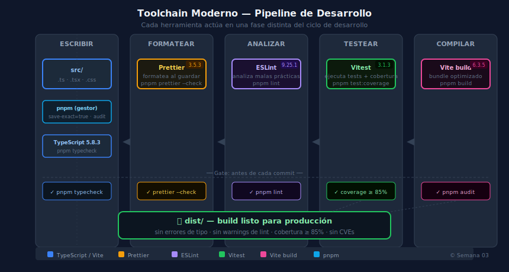

# 01 — Vite y Estructura de Proyecto

## Objetivos

- Entender por qué Vite reemplazó a Webpack en el ecosistema moderno
- Inicializar un proyecto React + TypeScript con pnpm
- Reconocer la estructura de carpetas estándar del bootcamp

---



---

## 1. ¿Por qué Vite?

Webpack agrupa todo el código antes de servirlo. Con proyectos grandes, eso significa
esperar varios segundos en cada cambio.

Vite usa **ES Modules nativos del navegador** durante desarrollo: solo carga el archivo
que cambió. El resultado es un HMR (Hot Module Replacement) casi instantáneo.

```bash
# Crear proyecto con pnpm (sin rangos, sin npm)
pnpm create vite@6.3.5 mi-app -- --template react-ts
cd mi-app
pnpm install
pnpm dev
```

> Vite ≥ 5 requiere Node ≥ 18. Verifica con `node -v`.

## 2. Anatomía de un proyecto Vite

```
mi-app/
├── public/          # Assets estáticos (no procesados)
├── src/
│   ├── assets/      # Imágenes, fuentes (importadas por JS)
│   ├── components/  # Componentes React reutilizables
│   ├── hooks/       # Custom hooks
│   ├── types/       # Interfaces y tipos TypeScript
│   ├── App.tsx      # Componente raíz
│   └── main.tsx     # Entry point — ReactDOM.createRoot
├── index.html       # HTML base (Vite lo sirve directamente)
├── vite.config.ts   # Configuración de Vite
├── tsconfig.json    # Configuración TypeScript
└── package.json     # Dependencias exactas (sin ^)
```

## 3. `vite.config.ts` esencial

```ts
import { defineConfig } from 'vite'
import react from '@vitejs/plugin-react'

// Configuración mínima para React + TypeScript
export default defineConfig({
  plugins: [react()],
  resolve: {
    alias: {
      '@': '/src', // Importar con @/components/... en vez de ../../
    },
  },
})
```

El alias `@` elimina rutas relativas largas (`../../components/Button`).

## 4. Scripts esenciales

```json
{
  "scripts": {
    "dev": "vite",
    "build": "tsc -b && vite build",
    "preview": "vite preview",
    "typecheck": "tsc --noEmit",
    "lint": "eslint . --max-warnings 0",
    "test": "vitest",
    "test:coverage": "vitest run --coverage"
  }
}
```

Ejecuta siempre `pnpm typecheck` antes de hacer commit.

## 5. Alias de path en TypeScript

Para que el alias `@` funcione también con TypeScript, añade en `tsconfig.json`:

```json
{
  "compilerOptions": {
    "baseUrl": ".",
    "paths": {
      "@/*": ["src/*"]
    }
  }
}
```

---

## Checklist

- [ ] ¿Puedes explicar por qué Vite es más rápido que Webpack en desarrollo?
- [ ] ¿Sabes qué archivo es el entry point de React en Vite?
- [ ] ¿Configuraste el alias `@` en `vite.config.ts` y `tsconfig.json`?
- [ ] ¿Todos los scripts del `package.json` están presentes y funcionan?

## Referencias

- [Documentación oficial de Vite](https://vitejs.dev/guide/)
- [Why Vite — motivación del equipo](https://vitejs.dev/guide/why.html)
