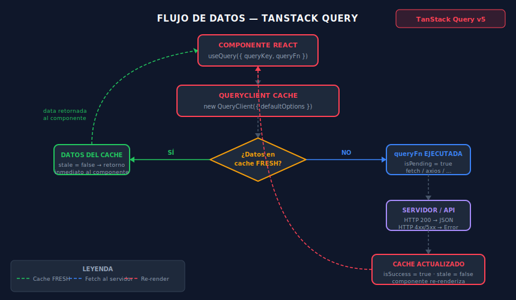

# useQuery: Fundamentos

## Objetivos

- Usar `useQuery` con tipado genérico para obtener datos del servidor.
- Distinguir los estados `isPending`, `isError` e `isSuccess`.
- Implementar early returns para loading, error y datos vacíos.

## Diagrama



## 1. Anatomía de useQuery

`useQuery` recibe un objeto de configuración con dos campos obligatorios:

```ts
import { useQuery } from '@tanstack/react-query'

const { data, isPending, isError, error } = useQuery<Post[], Error>({
  queryKey: ['posts'],          // identificador único en el cache
  queryFn: () => fetchPosts(),  // función que devuelve una Promise
})
```

El genérico `<TData, TError>` hace que `data` sea `Post[] | undefined`
y `error` sea `Error | null` — sin `any`.

## 2. Estados de la query

| Estado | Cuándo ocurre |
|--------|---------------|
| `isPending` | Primera carga, sin datos en cache |
| `isFetching` | Fetching en background (hay datos en cache) |
| `isSuccess` | Datos disponibles y sin error |
| `isError` | La `queryFn` lanzó un error |

> `isPending` reemplazó a `isLoading` como nombre en TanStack Query v5.

## 3. Early returns: el patrón correcto

El componente debe manejar cada estado antes del render principal:

```tsx
export function PostList() {
  const { data: posts, isPending, isError, error } = useQuery<Post[], Error>({
    queryKey: ['posts'],
    queryFn: fetchPosts,
  })

  if (isPending) return <p>Cargando publicaciones…</p>
  if (isError) return <p>Error: {error.message}</p>
  if (!posts?.length) return <p>No hay publicaciones.</p>

  return (
    <ul>
      {posts.map(post => (
        <li key={post.id}>{post.title}</li>
      ))}
    </ul>
  )
}
```

## 4. queryKey: identificador del cache

La `queryKey` identifica la entrada en el cache. Dos queries con la misma key
comparten los mismos datos sin hacer una segunda petición al servidor.

```ts
// key simple — lista global
useQuery({ queryKey: ['posts'], queryFn: fetchPosts })

// key con parámetro — entrada distinta por ID
useQuery({ queryKey: ['posts', postId], queryFn: () => fetchPost(postId) })
```

## 5. queryFn y fetch tipado

```ts
interface Post {
  id: number
  title: string
  body: string
}

async function fetchPosts(): Promise<Post[]> {
  const response = await fetch('https://jsonplaceholder.typicode.com/posts')
  if (!response.ok) throw new Error(`HTTP ${response.status}`)
  return response.json() as Promise<Post[]>
}
```

## Checklist

- [ ] ¿Tipar siempre los genéricos `useQuery<TData, TError>()`?
- [ ] ¿El componente maneja `isPending`, `isError` y el caso vacío?
- [ ] ¿La `queryKey` cambia cuando cambian los parámetros de la query?
- [ ] ¿La `queryFn` lanza un `Error` cuando el servidor responde con error?

## Referencias

- [useQuery API Reference](https://tanstack.com/query/latest/docs/framework/react/reference/useQuery)
- [Query Keys Guide](https://tanstack.com/query/latest/docs/framework/react/guides/query-keys)
